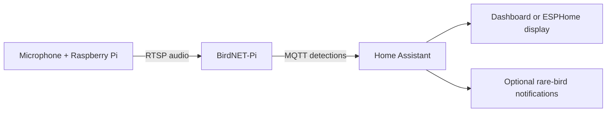

# BirdMic

BirdMic is a self-hosted bird-detection pipeline built around a small Raspberry Pi microphone node, an RTSP audio stream, BirdNET-Pi, MQTT, and Home Assistant. It can optionally drive an ESPHome display and notify you about birds that are unusual for your chosen eBird region.

This repository is a portable guide and set of helper scripts. Supply your own network names, addresses, coordinates, notification targets, and eBird region.

## Architecture

## What you need

- A Raspberry Pi capable of capturing from your microphone (a Pi Zero 2 W works well)
- A supported USB or I2S microphone/HAT
- Home Assistant, plus its Mosquitto MQTT broker add-on
- A BirdNET-Pi installation that can consume an RTSP stream
- Optional: an ESPHome-compatible display and an eBird account for regional rarity alerts

## Start here

1. Follow [the setup guide](bird-notifier.md) to install the Pi audio stream and connect BirdNET-Pi to Home Assistant.
2. Copy/adapt [`examples/home-assistant.yaml`](examples/home-assistant.yaml) into your Home Assistant configuration.
3. For regional rarity alerts, download the eBird bar chart for *your* region and run the scripts in [`scripts/`](scripts/).

## Repository layout

- [`bird-notifier.md`](bird-notifier.md) — end-to-end setup, display ideas, and troubleshooting
- [`examples/home-assistant.yaml`](examples/home-assistant.yaml) — Home Assistant configuration starting point
- [`scripts/parse_ebird_barchart.py`](scripts/parse_ebird_barchart.py) — turns an eBird bar-chart export into weekly frequency JSON
- [`scripts/check_rare_bird.py`](scripts/check_rare_bird.py) — looks up one species' frequency for a date
