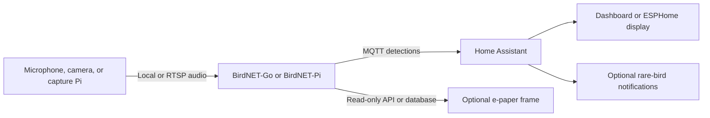

# BirdMic

BirdMic is a portable guide to a self-hosted bird-detection pipeline. A small
Raspberry Pi, camera, or other microphone source publishes audio to BirdNET-Go
or BirdNET-Pi; detections can then flow to Home Assistant, dashboards, and
dedicated displays. The project also covers optional regional rarity alerts.

This repository is a portable guide and set of helper scripts. Supply your own network names, addresses, coordinates, notification targets, and eBird region.

## Architecture

## What you need

- A supported USB, analog, camera, or I2S microphone source
- Optional: a Raspberry Pi capture node (a Pi Zero 2 W works well)
- Home Assistant, plus its Mosquitto MQTT broker add-on
- BirdNET-Go or a BirdNET-Pi installation that can consume your audio source
- Optional: a browser, ESPHome, or e-paper display and an eBird account for
  regional rarity alerts

## Start here

1. Follow [the setup guide](bird-notifier.md) to publish an audio stream and
   connect a BirdNET analyzer to Home Assistant.
2. Copy/adapt [`examples/home-assistant.yaml`](examples/home-assistant.yaml) into your Home Assistant configuration.
3. Choose a browser, Home Assistant, ESPHome, or e-paper presentation from
   [the display guide](display-options.md).
4. For regional rarity alerts, download the eBird bar chart for *your* region and run the scripts in [`scripts/`](scripts/).
5. If a former capture Pi is moving to a new job, use the
   [retirement and repurposing guide](repurposing.md).

## Repository layout

- [`bird-notifier.md`](bird-notifier.md) — end-to-end setup, display ideas, and troubleshooting
- [`display-options.md`](display-options.md) — HABirdDashboard and dedicated e-paper display patterns
- [`repurposing.md`](repurposing.md) — safely retire a capture node without mixing one-time cleanup into its new deployment
- [`examples/home-assistant.yaml`](examples/home-assistant.yaml) — Home Assistant configuration starting point
- [`examples/habird-dashboard.yaml`](examples/habird-dashboard.yaml) — artwork-focused Home Assistant Bird Card view
- [`scripts/parse_ebird_barchart.py`](scripts/parse_ebird_barchart.py) — turns an eBird bar-chart export into weekly frequency JSON
- [`scripts/check_rare_bird.py`](scripts/check_rare_bird.py) — looks up one species' frequency for a date
